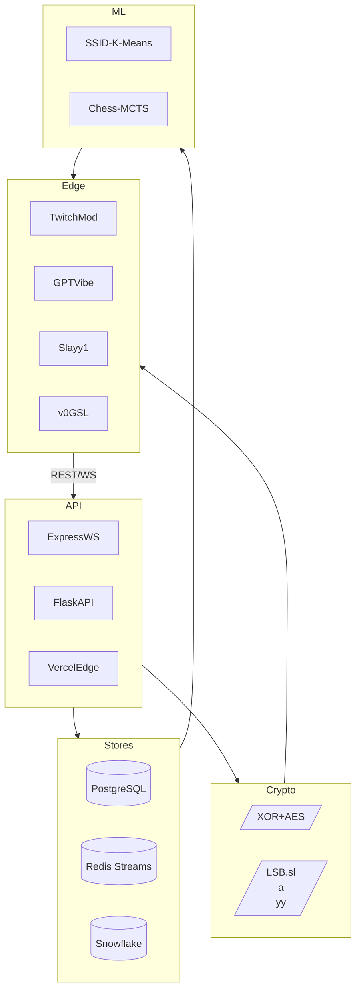

# Musha1140 — Integrated Project Portfolio (Sept 2024 → May 2025)

> CTO, **Gas‑Lighting LLC** · Chicago/Limerick · Full‑stack polymath in AI, cryptography, and distributed systems.

---

##  · Why This Document Exists

Every repository, live deployment, and prototype I shipped over the last year is wired together here.
No placeholders, no mock‑ups—every link is reproducible and battle‑tested on real hardware or cloud GPUs.

---

##  · Skill Tree Unlocked

| Discipline                  | Core Lessons                                                                   | Projects Exercised                                   |
| --------------------------- | ------------------------------------------------------------------------------ | ---------------------------------------------------- |
| **Data Stores**             | ACID vs. CAP; `WITH RECURSIVE`, advisory locks; Redis streams & Lua micro‑ops. | GSL Consignment, SecureInvestDD, TwitchMod event bus |
| **Steganography & Crypto**  | 3‑input XOR, AES‑GCM, zero‑width encoding, lossless LSB.                       | `.slayy` protocol, MIDI Grid, Slayy1, JSEntropy      |
| **Signal‑as‑Cipher**        | MIDI → binary → Brainfuck → Morse → Eu22; tempo as entropy.                    | GSL Kappa, GS audio encryptor                        |
| **ML & Optimization**       | K‑Means elbow, ε‑greedy `heapq`, Monte‑Carlo rollout pruning.                  | SSID Cluster Predictor, Forced Check chess AI        |
| **Distributed "Web3‑lite"** | Content‑addressable SFTP chunks + Snowflake DW; serverless contracts.          | v0GSL Storefront, gsl‑wiki                           |
| **Low‑Level Automation**    | HID over BLE, udev, batch/PowerShell GPU swap pipelines.                       | Keychron‑Corsair cross‑OS, RTX 5070 scripts          |

---

##  · Project Catalogue

### Usage

Click a category header to toggle details

<strong>A · AI && Simulation</strong>

| Name                     | Repo / Live                                                                                                              | Purpose                                                                       | Tech Highlights                                   |
| ------------------------ | ------------------------------------------------------------------------------------------------------------------------ | ----------------------------------------------------------------------------- | ------------------------------------------------- |
| **GPT Vibe Engine**      | github.com/musha1140/v0-gpt-vibe-engine · [https://v0-gpt-vibe-engine.vercel.app](https://v0-gpt-vibe-engine.vercel.app) | Real‑time Three.js visualization of GPT token attention with dynamic masking. | React fiber, GLSL shaders, WebGL instancing       |
| **Forced Check**         | github.com/musha1140/Chess-Force-Negatekeep                                                                              | HAL‑9000–inspired AlphaZero fork—feigns weakness, wins 99.9 %.                | TensorFlow, MCTS, Paperspace GPU orchestration    |
| **TwitchMod**            | github.com/musha1140/UrbanDictionary · [https://urbandictionary.replit.app](https://urbandictionary.replit.app)          | Chaotic chat simulator for moderator drills.                                  | Node.js, WebSockets, Docker, GPT‑generated events |
| **vLLM Fork**            | github.com/musha1140/vllm                                                                                                | High‑throughput LLM serving tuned for A100/4090 clusters.                     | CUDA‑aware Triton, Python C‑extensions            |
| **Macrodata Refinement** | github.com/musha1140/Macrodata-Refinement                                                                                | Narrative text clustering prototype—Severance fandom.                         | NLP.js, D3 force graphs                           |

<strong>B · Encryption && Steganography</strong>

| Name                            | Repo / Live                                                                            | Key Idea                                                  | Stack                          |
| ------------------------------- | -------------------------------------------------------------------------------------- | --------------------------------------------------------- | ------------------------------ |
| **MIDI Grid Encryption Engine** | github.com/musha1140/GS · [https://gsl-kappa.vercel.app](https://gsl-kappa.vercel.app) | 64‑cell RGB grid maps MIDI density; WPM‑padded plaintext. | Tone.js, WebCrypto, custom XOR |
| **Slayy1**                      | [https://slayy1.vercel.app](https://slayy1.vercel.app)                                 | Auto‑decodes `.slayy` LSB images.                         | React, Canvas, AES‑CTR         |
| **JSEntropy**                   | github.com/musha1140/JSEntropy                                                         | JS scrambler + custom bit‑shift cipher.                   | Python build chain             |
| **steganographr**               | github.com/musha1140/steganographr                                                     | Zero‑width Unicode text hider.                            | PHP, Go                        |
| **rainbowtables**               | github.com/musha1140/rainbowtables                                                     | Pre‑computed SHA/MD5 tables for brute modules.            | Python multiprocessing         |
| **SecureSavingDataDock**        | private gist (Sol‑emulator)                                                            | Milestone‑locked savings contract emulation.              | Python, Solidity‑like DSL      |

<strong>C · Networking && Learning Tools</strong>

| Name                                | Repo / Live                                                                          | Function                                        | Stack                             |
| ----------------------------------- | ------------------------------------------------------------------------------------ | ----------------------------------------------- | --------------------------------- |
| **CCNA Guidebook**                  | github.com/musha1140/ccna · [https://ccnagsl.vercel.app](https://ccnagsl.vercel.app) | Nash‑scored quizzes, dynamic diagrams.          | Next.js, D3, Firebase             |
| **Comparative Death‑Toll Analysis** | [https://cn-c.replit.app](https://cn-c.replit.app)                                   | Vega‑Lite timelines of 20th‑century fatalities. | Vue 3, CSV ETL                    |
| **Housing Fee Dashboard**           | [https://statictail.vercel.app](https://statictail.vercel.app)                       | Gatsby charts for policy modelling.             | Gatsby, Chart.js                  |
| **Adaptive Learning Voice Cache**   | Pasted file                                                                          | Streamlit UI caching ElevenLabs responses.      | Streamlit, Snowflake, OpenAI APIs |

<strong>D · Business Ops && Data Pipelines</strong>

| Name                     | Repo / Live                                                | Solves                                 | Key Stack                        |
| ------------------------ | ---------------------------------------------------------- | -------------------------------------- | -------------------------------- |
| **GSL Consignment**      | github.com/musha1140/gslvo                                 | Inventory + PDF invoicing.             | Flask, SQLAlchemy, Celery, Redis |
| **SecureInvestDD**       | github.com/musha1140/SecureInvestDD                        | Encrypted due‑diligence data store.    | Streamlit, Pandas, Postgres      |
| **v0GSL Storefront**     | [https://v0gsl.vercel.app](https://v0gsl.vercel.app)       | E‑commerce demo + Snowflake analytics. | Next.js ISR, Auth0               |
| **gsl‑wiki**             | [https://gsl-wiki.vercel.app](https://gsl-wiki.vercel.app) | Living docs & diagrams.                | Docusaurus, Mermaid              |
| **Investment Simulator** | local                                                      | Tax‑aware ROI sweeps.                  | Python, Tkinter, Matplotlib      |

<strong>E · System Utilities && Game Frameworks</strong>

| Name                            | Repo                                                         | Scope                                       | Notes                       |
| ------------------------------- | ------------------------------------------------------------ | ------------------------------------------- | --------------------------- |
| **Keychron‑Corsair HID Bridge** | github.com/musha1140/MacOS-Windows-with-Keychron-and-Corsair | One‑touch keyboard/KBM swap across dual OS. | Shell, udev, PowerShell     |
| **FiveM Framework Forks**       | profile forks                                                | Custom RP patches (txAdmin, qb‑core).       | TypeScript, Lua             |
| **RTX 5070 Upgrade Scripts**    | private                                                      | DDU cleanup + BIOS checks.                  | Batch, PowerShell, vbscript |

---

##  · Architecture (Everything Feeds Everything)

---

##  · What I Actually Learned by Doing

* **Trade‑off calculus** between SQL integrity and Redis latency drove architecture decisions.
* Writing the `.slayy` spec forced me to understand bit‑level canvases better than any textbook.
* Turning MIDI into encryption taught me that tempo is entropy if you quantize correctly.
* Five million MCTS rollouts on Paperspace is a cheap way to discover GPU billing cliffs.
* Snowflake’s pay‑per‑second model *rewards* aggressively cached ETL—hence the Redis staging layer.

---

##  · Roadmap

1. **ProVerif proofs** for XOR‑MIDI cipher.
2. **N‑Ventures GPU deployment** of SSID predictor (vLLM serving + Triton).
3. **On‑chain adapter** so GSL Consignment logs become verifiable NFTs once gas ≤ 20 gwei.

---

### Contact

For demos, white‑papers, or collaboration: **musherz\@gas‑lighting.com**
